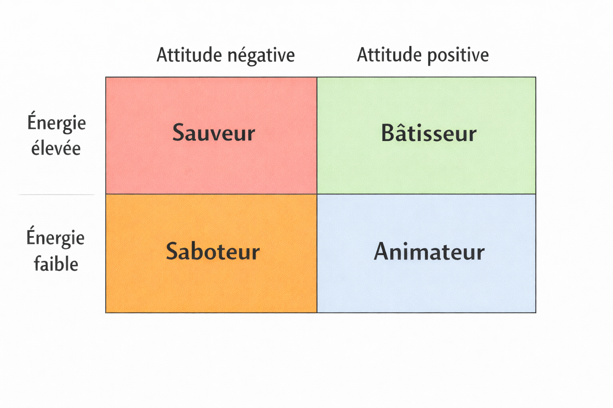

# Recruter des personnes avec de l'énergie positive

Après des dizaines d'embauches, en analysant a posteriori quels profils avaient le plus apporté, j’ai identifié 2 critères qui ressortent au-dessus de tous les autres.

Note : J'ai vendu ma société il y a 3 ans et j'ai démissionné du repreneur il y a un an. Cela m'a permis de prendre du recul sur ce qui avait bien et moins bien fonctionné sur différents sujets que je partage avec vous.

Note 2 : Ce contenu n’engage que moi, aucune des sociétés auxquelles je contribue ou ai contribué.

Le premier critère est l'énergie. Le deuxième critère est l'attitude positive.

À ce stade vous vous dites sans doute deux choses.

1/ c’est très large comme critères et sans doute difficile à évaluer

Pourtant, je suis sûr que si vous fermez les yeux 10 secondes vous pouvez classer n’importe lequel de vos collègues dans une de ces 4 catégories : énergie + positif, énergie + négatif, pas d'énergie + positif, pas d'énergie + négatif.

2/ qui des compétences ?

Concernant le point des compétences, je n'ai jamais connu quelqu'un avec de l'énergie et positif qui échoue sur le plan des compétences. Quand vous avez ce type de profil dans votre équipe ils peuvent abattre des montagnes et votre rôle est de les garder dans cette zone.

Le ratio de contribution à l'entreprise des personnes à énergie positive est incroyablement plus élevé. J'ai vu des équipes de 3 personnes performer nettement plus que des équipes de 10+.

Au passage, l'utilisation de l'intelligence artificielle agit non pas comme un outil permettant de mettre tout le monde sur la même base en terme d'impact, mais plutôt comme un levier supplémentaire de performance accentuant l'écart.

Le profil énergie + positif est celui qui va être dans l'amélioration continue, proposer des nouvelles choses et accompagner les équipes. Il demande finalement peu de management, mais il a besoin d'espace et d’autonomie pour s'exprimer et qu'on reconnaisse son travail en le valorisant. Le pire à faire est de le sous alimenter.

Le profil énergie + négatif, c'est le sauveur. Il performe mais il devient vite toxique pour la société. Il joue plus pour son compte que pour le collectif, et il le sait. C’est un cas très complexe à gérer car si à court terme il apporte beaucoup, à long terme il vous pénalise.

Le pas d'énergie + positif, c'est l'animateur. Il est utile dans une certaine mesure à maintenir une bonne cohésion d'équipe et créer du lien. Il fait avancer modestement les projets, mais sans lui la machine peut se gripper.

Le pas d'énergie + négatif, c'est le saboteur. Il critique tout et tout le temps, et cache ses manques derrière les autres.

La plus grande difficulté dans mon expérience, c'est que les personnes ne changent jamais en mieux. Elles vont progressivement tendre vers moins. Gardez en tête que le voyage ne se fait que dans un sens.

Spoiler : Donner plus d'argent à quelqu'un ne le fera pas changer de catégorie, en tout cas pas durablement.

Trouver en amont les bonnes personnes est donc aussi important que de garder ceux qu'on a à leur plein potentiel.

Mais pour ça il n’existe pas de recette miracle, ou si vous l’avez 👇
